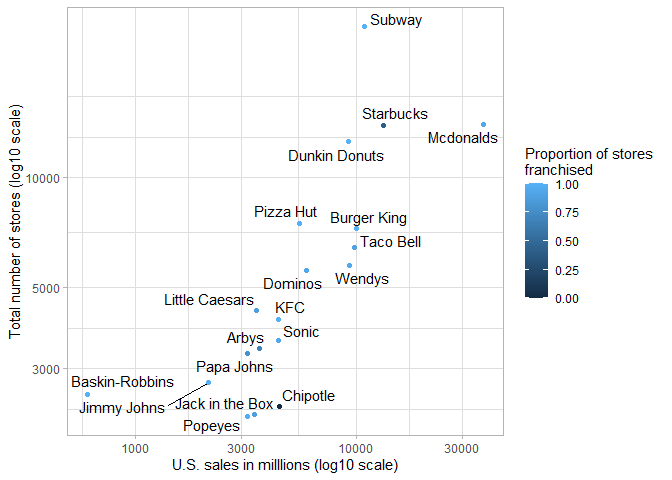
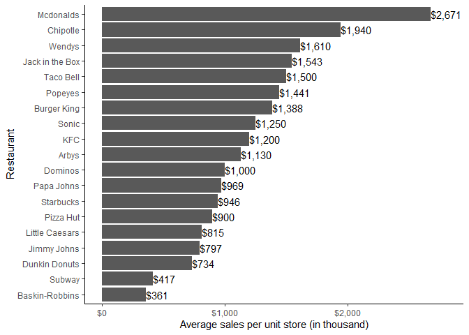
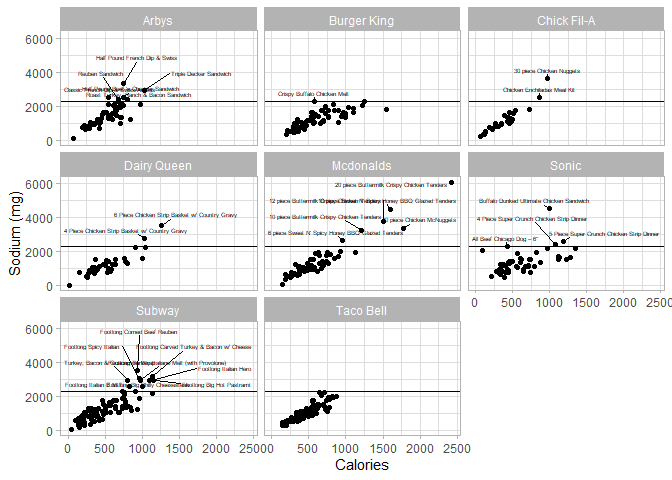
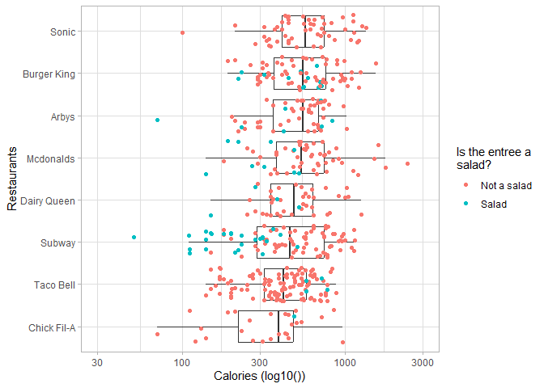
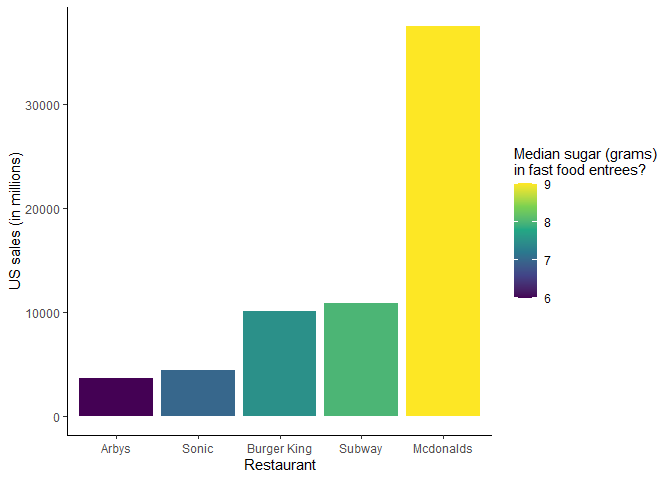

Visualizing Data in the Tidyverse
================
Julian Posada
2023-01-26

### Johns Hopkins University

### Tidyverse Skills for Data Science in R Specialization

### Course Project

### Data sets:

#### Data set: annual sales information and number of stores per fast food restaurants in 2018 (data_fastfood_sales.csv) \[858b\]

#### Data set: nutrition information about entrees from fast food restaurants (data_fastfood_calories.csv) \[50Kb\]

#### Source: Data originally from the [GitHub repository](https://github.com/rfordatascience/tidytuesday/tree/master/data/2018/2018-09-04) from the Tidy Tuesday project in R4DS online learning community

### MIT licensed

``` r
#Loading the libraries that are needed for the whole project. 
library(readr)
library(visdat)
library(skimr)
library(here)
library(tidyverse)
library(ggplot2)
library(ggrepel)
library(scales)
library(knitr)
```

``` r
#using the library here and readr to load a csv into a data frame
data_fastfood_sales <- read_csv(here::here("data","raw_data","data_fastfood_sales.csv"))
```

### Problem 1

``` r
knitr::include_graphics(here::here("images", "problem_1.jpg"))
```


``` r
data_fastfood_sales %>% mutate(proportion = num_franchised_stores / unit_count) %>% 
  ggplot(aes(x = us_sales, y = unit_count)) + 
  geom_point()+                         # it creates a scatter plot
  scale_x_continuous(trans = 'log10')+  # X-axis to log10
  scale_y_continuous(trans = 'log10')+  # Y-axis to log10
  xlab("U.S. sales in milllions (log10 scale)")+
  ylab("Total number of stores (log10 scale)")+
  scale_color_continuous(name = "Proportion of stores \nfranchised")+
  geom_text_repel(aes(label = restaurant, direction = 'both'))+  # It set the                                                                   #restaurant names on the plot
  geom_point(aes(color = proportion)) +
  theme_light()
```


\### Problem 2

``` r
knitr::include_graphics(here::here("images", "problem_2.jpg"))
```


``` r
data_fastfood_sales %>% 
  ggplot(aes(label = label_dollar()(ceiling(average_sales)),  
             x = average_sales, 
             y = reorder (restaurant, average_sales))) +
  geom_bar(stat = "identity")+ # stat ="identity" is to change the default count modus of                                    # geom-bar()
  xlab("Average sales per unit store (in thousand)")+
  ylab("Restaurant")+
  geom_text(hjust = 0,  check_overlap = TRUE)+        # hjust changes the horizontal outlining. 0 = right
  scale_x_continuous(labels=scales::dollar_format())+ # it transforms the average sales to                                                          # money
  theme_classic()+
  coord_cartesian(xlim= c(0,2800))
```



### Problem 3

``` r
knitr::include_graphics(here::here("images", "problem_3.jpg"))
```


``` r
data_fastfood_calories <- read_csv(here::here("data","raw_data", "data_fastfood_calories.csv"))
#vis_dat(data_fastfood_calories)
#skim(data_fastfood_calories)
```

``` r
data_fastfood_calories%>% 
  ggplot(aes(x = calories, y = sodium,
             label = item))+ 
  geom_jitter(position = position_jitter(width = NULL, 
                                         height = NULL, 
                                         seed = NA))+
  facet_wrap(~restaurant)+
  geom_hline(yintercept = 2300)+
  xlab("Calories")+
  ylab("Sodium (mg)")+
  geom_text_repel(data=filter(data_fastfood_calories, 
                              sodium>2300), 
                              size = 1.5,
                              min.segment.length = 0, 
                              nudge_y = 50, 
                              ylim = c(2300, NA),  # labels above 2300 line
                              max.overlaps = Inf,
                              direction = "both")+
  theme_classic() + theme_light()+  
  theme(legend.position = "none")+
  scale_y_continuous(breaks = seq(0, 6000, by = 2000))
```



### Problem 4

``` r
knitr::include_graphics(here::here("images", "problem_4.jpg"))
```


``` r
data_fastfood_calories%>% 
  mutate(salad = str_detect(item, "Salad")) %>% 
  mutate(salad = case_when(salad ~  "Salad",
                    !salad  ~ "Not a salad")) %>% 
  group_by(restaurant)%>% 
  summarize(median = median(calories), salad, calories, .groups = "drop") %>% 
  arrange(-median)%>% 
  ggplot(aes(x = calories, y = reorder (restaurant, median)))+
  geom_boxplot(outlier.shape = NA)+
  geom_jitter(aes(color = salad))+
  scale_x_continuous(trans = 'log10')+ 
  coord_cartesian(xlim= c(30,3000))+
  labs(color = "Is the entree a\nsalad?")+
  ylab("Restaurants")+
  xlab("Calories (log10())")+
  theme_classic()+
  theme_light()
```

<!-- -->

### Problem 5

``` r
knitr::include_graphics(here::here("images", "problem_5.jpg"))
```


``` r
df_sugar_filtered <- data_fastfood_calories%>% 
  filter(restaurant != "Taco Bell") %>% 
  select(restaurant,item,sugar) %>% 
  group_by(restaurant) %>% 
  summarise(median_sugar = median(sugar),.groups = "drop") %>% 
  arrange(-median_sugar)

df_us_sales <- data_fastfood_sales %>%  
  select(restaurant,us_sales) #%>% mutate(us_sales = dollar(us_sales))

df_us_sales_vs_sugar <- left_join(df_sugar_filtered, df_us_sales, by = "restaurant") %>% 
  drop_na() %>% 
  arrange(us_sales)
  
df_us_sales_vs_sugar %>% 
  ggplot(aes(x = reorder(restaurant, us_sales), 
             y = us_sales, 
             fill = median_sugar))+
  geom_bar(stat = "identity")+
  theme_classic()+
  theme(legend.position = "right")+ ## to chanage the position of the legend.
  scale_fill_continuous(type = 'viridis')+ # 
  #to change the default gradient.. 2 includes mid.  you can use color as well
  ylab("US sales (in millions)")+
  xlab("Restaurant")+
  labs(fill = "Median sugar (grams)\nin fast food entrees?")
```

<!-- -->

``` r
knitr::include_graphics(here::here("images", "palette.jpg"))
```


